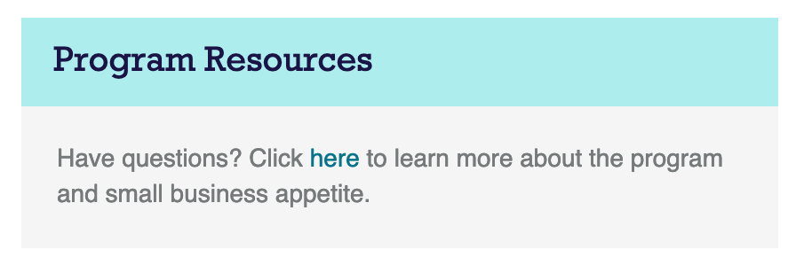

# Exercise 1

Instructions: Please complete the following requirements ensuring your solution meets all of them. Going above and beyond the requirements is great so long as all of the requirements are met. Before coding anything, please read all of the requirements first. If you are unsure about anything, please ask the instructor.

## Requirements

**Requirement 1.** Create a new component named Message Box.

**Requirement 2.** Message Box should receive two props. The first prop is the header text of the message box. The second prop is passed as the child content of the component it can be any valid JSX.

**Requirement 3.** Style the message box to look like this:



Use the following HTML template:

```html
<div class="panel panel-default">
  <h3 class="panel-heading">
    ​Program Resources
  </h3>
  <div class="panel-body">
    <p>
      ​Have questions? Click <a href="#" target="_blank">here</a> to
      learn more about the program and small business appetite.
    </p>
  </div>
</div>
```

**Requirement 4.** Make sure to specify the needed prop types for the component.

**Requirement 5.** Display two examples of the component on the screen. The example should use different sets of prop values, but the content can be whatever you would like it to be. 

**Ensure it all works, and please raise your hand when you are done.**